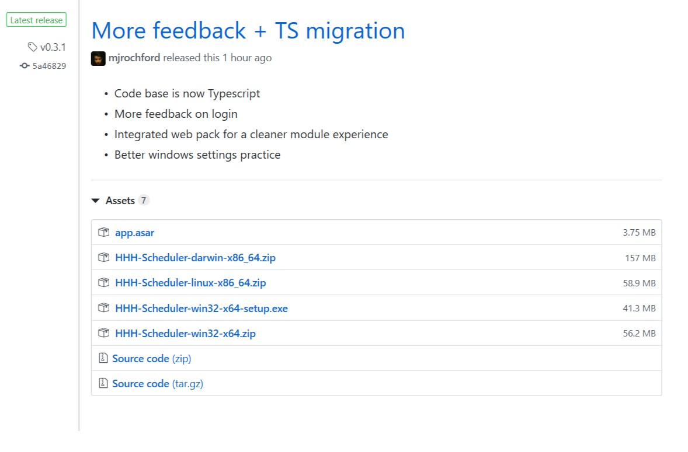
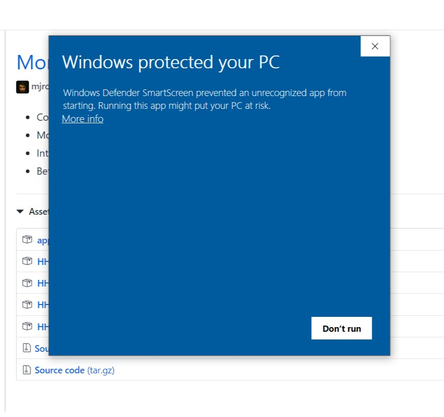
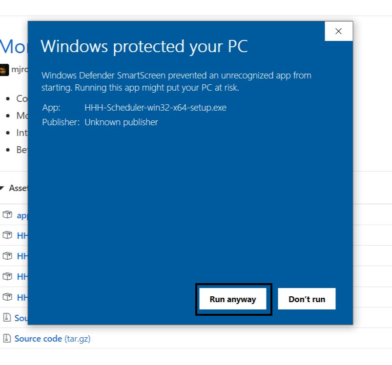

# Happy Hound Scheduler  

## Installation  

### Windows 10  
1. Download Hounds-x.x.x-Web-Setup.exe from the [releases page](https://GitHub.com/hhhotel/scheduler/releases/latest)  
  
2. Run the setup program  
3. Click more info and run anyway  
  
  
4. Follow the instructions to install the program  

### MacOS  
1. Download the Hounds-x.x.x-mac.zip package from the [releases page](https://GitHub.com/hhhotel/scheduler/releases/latest)  
2. Open finder and go to your downloads folder  
3. Ctrl-Click on Hounds.app and click open, this creates an exception allowing the unsigned app  
   to be run without further changes  
4. Copy Hounds.app into your /Applications folder
