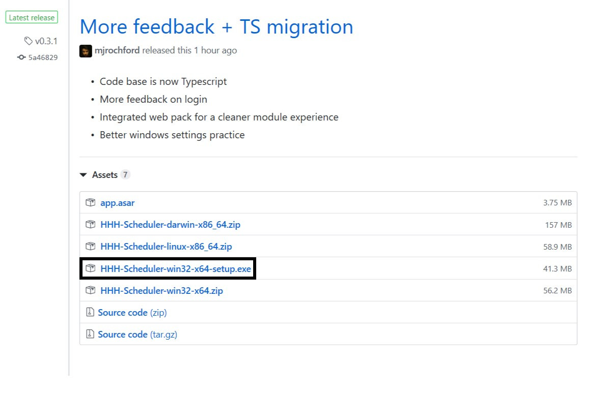

# Happy Hound Scheduler  

## Installation  

### Windows 10  
1. Download win32-x64-setup.exe from the [releases page](https://GitHub.com/hhhotel/scheduler/releases/latest)  
  
2. Run the setup program  
3. Click more info and run anyway  
  
  
4. Follow the instructions to install the program  

### MacOS  
1. Download the darwin-x86_64 package from the [releases page](https://GitHub.com/hhhotel/scheduler/releases/latest)  
2. Unzip the file you just downloaded  
3. Inside the new folder copy HHH-Scheduler.app into your /Applications folder  
